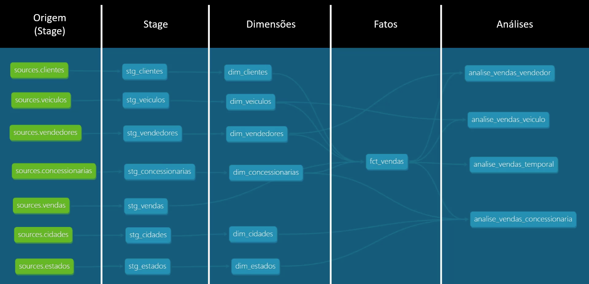

# DBT - Transformação e modelagem de dados

## Visão Geral
O **DBT (Data Build Tool)** foi utilizado para transformar os dados no **Snowflake**, organizando-os em diferentes camadas para análise eficiente.

## Estrutura do projeto

📂 [`stage/`](./code/models/stage/) – Extração dos dados brutos sem transformações.  
📂 [`dimensions/`](./code/models/dimensions/) – Tabelas normalizadas usadas como referência.  
📂 [`facts/`](./code/models/facts/) – Dados transacionais vinculados às dimensões e vendas.  
📂 [`analysis/`](./code/models/analysis/) – Relatórios agregados para insights.  
📂 [`tests/`](./code/tests/) – Validações para garantir a integridade dos dados.  

Com essa estrutura, o **DBT** automatiza a transformação dos dados extraídos do **PostgreSQL**, tornando-os prontos para análise no **Snowflake**. 
