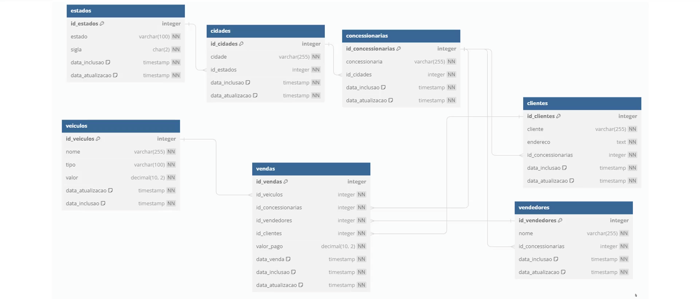

# Análise exploratória no PostgreSQL

## Conexão com o banco de dados
Para acessar os dados, utilizamos o **PgAdmin** para conectar ao banco **PostgreSQL** e explorar sua estrutura. Essa conexão permitiu visualizar tabelas e executar consultas SQL para análise dos dados.

## Estrutura das tabelas
O banco de dados contém as seguintes tabelas: `cidades`, `clientes`, `concessionarias`, `estados`, `vendas`, `veiculos`, `vendedores`.

Abaixo está um diagrama relacional representando a estrutura do banco de dados:

## Exercícios de exploração de dados
Dentro do subdiretório [**atividades-sql**](./atividades-sql), há 10 exercícios utilizados para praticar a exploração dos dados. Cada atividade envolve consultas SQL para responder a perguntas específicas sobre os dados.

Vale ressaltar que este é um **banco de dados vivo**, ou seja, ao longo do dia, novos dados são inseridos automaticamente, simulando um ambiente real de negócios.

### Atividades:

1. [**Seleção Simples**](./atividades-sql/selecao-simples.sql)  
   _Descrição:_ Liste todos os veículos com tipo 'SUV Compacta' e valor inferior a 30.000,00.

2. [**Junção Simples**](./atividades-sql/juncao-simples.sql)  
   _Descrição:_ Exiba o nome dos clientes e o nome das concessionárias onde realizaram suas compras.

3. [**Contagem e Agrupamento**](./atividades-sql/contagem-e-agrupamento.sql)  
   _Descrição:_ Conte quantos vendedores existem em cada concessionária.

4. [**Subconsulta**](./atividades-sql/subconsulta.sql)  
   _Descrição:_ Encontre os veículos mais caros vendidos em cada tipo de veículo.

5. [**Junção Múltipla**](./atividades-sql/juncao-multipla.sql)  
   _Descrição:_ Liste o nome do cliente, o veículo comprado e o valor pago, para todas as vendas.

6. [**Filtro com Agregação**](./atividades-sql/filtro-com-agregacao.sql)  
   _Descrição:_ Identifique as concessionárias que venderam mais de 5 veículos.

7. [**Consulta com ORDER BY e LIMIT**](./atividades-sql/consulta-com-orderby-e-limit.sql)  
   _Descrição:_ Liste os três veículos mais caros disponíveis.

8. [**Consulta com Datas**](./atividades-sql/consulta-com-datas.sql)  
   _Descrição:_ Selecione todos os veículos adicionados no último mês.

9. [**Junção Externa**](./atividades-sql/juncao-externa.sql)  
   _Descrição:_ Liste todas as cidades e qualquer concessionária nelas, se houver.

10. [**Consulta com Várias Condições**](./atividades-sql/consulta-com-varias-condicoes.sql)  
    _Descrição:_ Encontre clientes que compraram veículos 'SUV Premium Híbrida' ou veículos com valor acima de 60.000,00.
